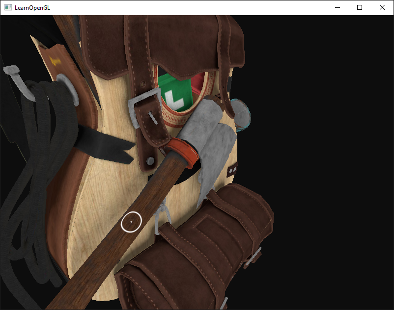

# Minimal yet useful stereo example

### Idea & Background

The idea of this example is to show a *minimal* setup for native stereo rendering and hints how interactions can be implemented leveraging stereo. 
Often examples are quite large and full of implementation details (layered rendering, multi-view extensions, model loading, ui frameworks etc.) or or too small not even showing how the camera and mouse interactions should be adapted. This example fills this gap.
However, throughout in the code walkthrough i give pointers to advanced topics and more efficient implementations.


## What do i change in an existing example?

The code is based on [the model loading example](https://github.com/JoeyDeVries/LearnOpenGL/tree/a545a703f95893258d16dbe32f5ccbb6400fd213/src/3.model_loading/1.model_loading). The changes are really minimal:
1. create a stereo window: 
`glfwWindowHint(GLFW_STEREO, 1)`

    The window creation might fail if there is no hardware support. Write proper fallback code, as hinted [here](https://github.com/haraldsteinlechner/LearnOpenGL/blob/468c193368eba875d87d03a6e252663b61c12a55/src/8.guest/2024/8.stereo/stereo.cpp#L75).

    If all worked out can be checked using `glGetBooleanv(GL_STEREO, &stereoEnabled)` when a context is active.

2. Adapt the projection:

    Adjust clip positions accordingly. In essense you need: `clipPos.x += EyeSign * Separation * ( clipPos.w – Convergence )`

    Or on CPU side we could adjust the center projection matrix:
    ```
    // could be done in shader. code from here [1] https://www.nvidia.com/content/gtc-2010/pdfs/2010_gtc2010.pdf
    glm::mat4 offsetProjection(glm::mat4& centerProjection, float separation, float convergence) {
        glm::mat4 o = glm::mat4(centerProjection);
        o[2][0] = o[2][0] + separation;
        o[3][0] = o[3][0] + separation * convergence;
        return o;
    }
    ```

    Consult nvidia docs for the background [here](https://www.nvidia.com/content/gtc-2010/pdfs/2010_gtc2010.pdf).

3. Adapt the rendering code

    There are many approaches to get two images into the stereo window. The most portable one is to just render twice. The adjusted rendering code then looks like:
    ```
            glDrawBuffer(GL_BACK_LEFT);
            glClear(GL_COLOR_BUFFER_BIT | GL_DEPTH_BUFFER_BIT);
            ourShader.setMat4("projection", offsetProjection(centerProjection, -separation, -camera.GetRadius()));
            ourShader.setVec4("debugColor", glm::vec4(1.0, 0.0, 0.0, 1.0));
            ourShader.use(); 
            ourModel.Draw(ourShader);  

            glDrawBuffer(GL_BACK_RIGHT);
            glClear(GL_COLOR_BUFFER_BIT | GL_DEPTH_BUFFER_BIT);
            ourShader.setMat4("projection", offsetProjection(centerProjection, separation, -camera.GetRadius()));
            ourShader.setVec4("debugColor", glm::vec4(0.0, 1.0, 0.0, 1.0));
            ourShader.use();
            ourModel.Draw(ourShader); 
    ```

    There are other options such as using layered rendering (e.g. using [layered rendering](https://registry.khronos.org/OpenGL-Refpages/gl4/html/gl_Layer.xhtml), or using [multiview](https://registry.khronos.org/OpenGL/extensions/OVR/OVR_multiview.txt), or even multi-gpu to render eyes side-by side). In the end those are technical details for getting the images into the framebuffer.

4. Adapt the mouse cursor

    Without taking care of the cursor explicitly, users get heavily disturbed by the interaction of the 3D scene and UI elements in particular the mouse cursor.

    Again, there are many methods of varying complexity, most important however is to render a proxy mouse cursor at reasonable depth.

    In this example i use a world-space circle directly rendered onto the object serving as simple cursor placed at the correct depth. This could be combined with different modes, or the cursor could be blitted directly to the quad buffer window (ore even more complex using hardware mouse cursors...)

    Next we need to get proper world space coordinates of the mouse cursor. This could be done by intersecting the center projection ray with the scene.
    Most applications will have special code anyways, so in this example i will use the a super simple framebuffer readback based approach (old school).
    The standard code could look as such:
    ```
    { 
        float depth = 0.0; 
        glReadPixels(lastX, currentWinHeight - lastY, 1, 1, GL_DEPTH_COMPONENT, GL_FLOAT, &depth);
        glm::mat4 vpInv = glm::inverse(projection * view); 
        glm::vec4 ndc = glm::vec4((lastX / currentWinWidth) * 2.0 - 1.0, 1.0 - (lastY / currentWinHeight) * 2.0, depth * 2.0 - 1.0, 1.0);
        auto worldPosH = vpInv * ndc;
        auto worldPos = worldPosH / worldPosH.w; 
        }
    ```
    Again, please note that this could be improved using render-to-texture, asynchronous readback aso. but again this is rather application specific.

    Now with `worldPos` at hand which we can use in the shader directly.
    Also, by looking at `depth` we know if we picked the far plane. If so, use the windowing api to show the cursor, and hide it respectively:
    ```
            auto isHit = depth != 1.0;
        if (isHit) {
            glfwSetInputMode(window, GLFW_CURSOR, GLFW_CURSOR_HIDDEN);
        }
        else {
            glfwSetInputMode(window, GLFW_CURSOR, GLFW_CURSOR_NORMAL);
        }
    ```

    Next, pass the position to the shader and encode whether the cursor is valid in the `w` comonent:
    ```
            ourShader.setVec4("cursorPos", glm::vec4(worldPos.x, worldPos.y, worldPos.z, depth != 1.0 ? 1.0f : 0.0f));
    ```

    In the shader one can use procedural methods for creating a visual cursor representation e.g. by changing the fragment color if it is within the cusor range. Here, i used smooth interpolation to prevent shader aliasing as such:
    ```
    FragColor = texture(texture_diffuse1, TexCoords);

    if(cursorPos.w > 0) {
        float distanceToCursor = length(cursorPos.xyz - FragWorldPos);

        float outerRadius = 0.08; 
        float outerBorderThickness = 0.01;
        float innerRadius = 0.004;
        float innerBorderThickness = 0.005;
        float tOuter = 1.0 - smoothstep(0.0, outerBorderThickness, abs(outerRadius - distanceToCursor));
        float tInner = 1.0 - smoothstep(0.0, innerBorderThickness, abs(innerRadius - distanceToCursor));
        vec4 inner = mix(FragColor, vec4(1.0, 1.0, 1.0, 0.5), tInner);
        FragColor = mix(inner, vec4(1.0, 1.0, 1.0, 1.0), tOuter);
    }
    ```

    


    That's it, we just added portable stereo to an existing application, adapted the framebuffer creation, modified clip coordiantes and implemented a simple 3D cursor <3.